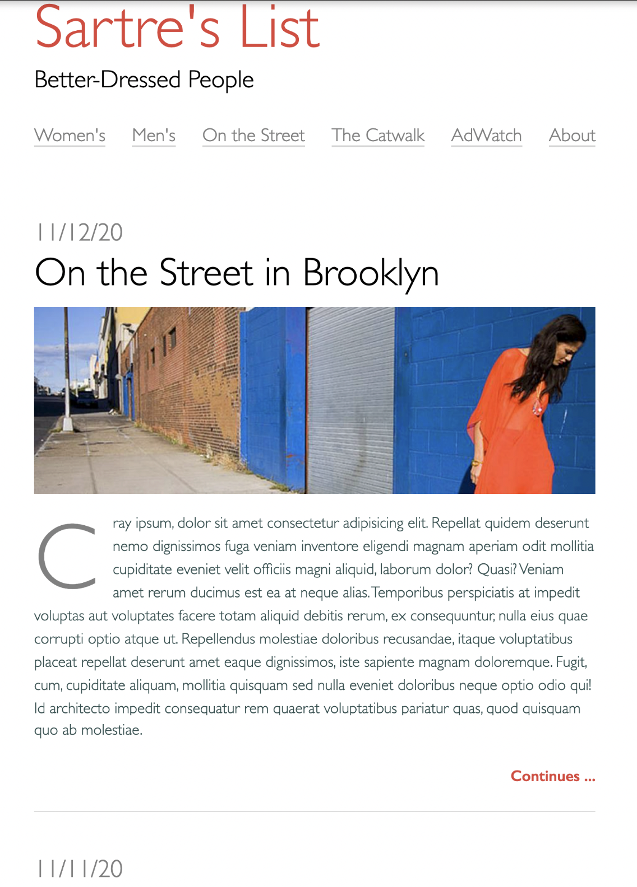

# Fashion Blog 


**[Code Sandbox for React Solution]**



[Fashion Blog](https://sfs-flex-evelyn.herokuapp.com/react/week-19/day-3/hw)


## Part 1

Fashion Blog (BUILD IN PLAIN HTML, Make locally, Push to Github, Deploy on Github Pages & Then remake in react and deploy to Netlify)

Hone your skills in HTML & CSS by building a page that is based on a mock up!


**Prerequisites**

* HTML & CSS
* Flexbox
* React
* Instructions
* Download the following images

 

**Requirements**

Faithfully reproduce the mockup in HTML & CSS.

**goal**

Build Your HTML

1. Create your html boilerplate in the index.htmlfile.

1. Add a new file called style.cssand link it to the HTML file.

1. In the body of your HTML, use header, main, and footertags to clearly define the different parts of the page.

1. Use an h1 tag for the site title and an h2 for the subtitle inside the page header.

1. Use navtags inside the page header to create an accessible navigation. Follow the example in the W3C Web Accessibility Initiative (WAI) Guidelines to format your navigation:

1. Wrap each link in an anchor tag

1. Wrap each anchor tag in a list item

1. Wrap all of the list item tags in an unordered list tag

1. Place the unordered list inside the the nav tag and give it attributes for aria-label="Main Navigation"and role="navigation"

1. Mark up both of the blog posts using the articletag.

1. Use this W3C WAI Guideline example, to help you structure your blog post content. Follow the pattern! Make sure there is a <p> tag that contains some lorem ipsum text **Remember you can create this with Emmet by typing p>loremand pressing tab!**

1. Make sure your images all have altattributes so that they are accessible.

1. Inside the page footer, use the same technique you used earlier to create a semantic and accessible navigation, using a wrapping navtag, unordered list and the aria attributes.

1. Add a copyright in the footer. For the © symbol, use an html entity.

1. Make sure to add and commit your changes when you've got the html done!

**Style Your Page**

1. Use a border only on the left side of the page's htmlelement. It should have a width of 5px and a color of lightgray.

1. Set the bodyelement's min-height to be at least 100% of the viewport height. Also, use the font-family property to set the entire page to use sans-serif fonts.

1. Give the body a max-widthof 1000px and center it on the page with the margin auto technique.

1. The border is too close to our text and we've got an issue with margin-collapse at the top of the page! Add padding to the header, main and footer elements of 1rem on the top and bottom and 2rem on the left and right to fix these issues.

1. For the h1 on the page we want the color to be tomato.

1. Set all of the images to have a widthof 100%.

1. For your site navigation, you'll need to remove all of the padding on the ul elements and then set it's list-style-type to none. 

1. It would be a good idea to use a class to style the navigation so that you can still make a bulleted list on your page. 

1. Use Flexbox to style the ul for the navigation elements. On the top navigation use the **space-between** rule to have the menu items spread across their container evenly. 

1. Set the color for the anchors inside the main navigation to be lightgray and the footer navigation to be tomato.

1. Style the title of each of your blog posts so that they are larger.

1. Style the 'continues...' anchor tags so that they are aligned to the right and are bold and tomato colored.

1. Set the margin on the bottom the article tags to be 4rem. Also, add a 1px solid border in lightgray to the bottom of each one and give **each padding on the bottom of 2rem.**

1. For the ptag inside your article, use the pseudo-element ::first-letter to style the drop cap and set it's color to lightgray.

1. Style the copyright so it is lightgray.

1. Awesome job, add, commit and push changes to create your pull request!

# Part 2

## REMAKE ENTIRE PROJECT IN REACT and deploy to NETLIFY

**Use** 

* App.js 
* Header.js 
* Nav.js 
* Article.js
* Footer.js

Deploy on Netlify. (Link github to netlify for free)

1. Run Build command in your app in the command line (For React app only)

```js
npm run build
```

1. Drag and drop folder from your computer into netlify

**Submission**

In the github readme for your React Application - Remove all the React boilerplate information and replace with the following:

[Netlify Live Link](https://sfs-flex-evelyn.herokuapp.com/react/week-19/day-3/hw)

[Github pages Live Link](https://sfs-flex-evelyn.herokuapp.com/react/week-19/day-3/hw)

[Github link of html version](https://sfs-flex-evelyn.herokuapp.com/react/week-19/day-3/hw)

## For the react app, here are some code snippets to reuse in components.

<details>
     <summary>Nav.js</summary>

```js
export default function Nav(props) {
	return (

                    <nav class= "navs"aria-label="Main Navigation" role="navigation">
          <ul>
            <li class="headerLink"><a href="/">Women's</a></li>
            <li class="headerLink"><a href="/">Men's</a></li>
            <li class="headerLink"><a href="/">On the Street</a></li>
            <li class="headerLink"><a href="/">TheCatwalk</a></li>
            <li class="headerLink"><a href="/">AdWatch</a></li>
            <li class="headerLink"><a href="/">About</a></li>
          </ul>
        </nav>

               );
          }
```
</details>

<details>
     <summary>Header.js</summary>

```js
export default function Header(props) {
	return (
		<header className="app-header">
			<h1 className="header">{props.name}</h1>
               <h2 class ="subheader">Better-Dressed People</h2>
          </header>
	);
}

```
</details>

<details>
     <summary>Footer.js</summary>

```js
export default function Footer(props) {
     return (
          <footer>

               <h6 class="copyWrite">&copy Valet, Industries, Inc</h6>

          </footer>
          )
}
```
</details>

<details>
     <summary>Article.js</summary>

```js
export default function Article(props) {
	return (

<div class="box">
    <h2 class="date">12/11/22</h2>
    <h1 class="blogHeader">On the Street in Brooklyn</h1>
    <a ></a>
     <p class="post">I love how this red dress so unconsciously contrasts with the vibrant azure, in order to bring our eyes back to the sky. Despite this attempt to cancel the artificial, the girl is hollow; irreverent of the blue sky, only finding the smog of the filthy sidewalk. Vanity. love how this red dress so unconsciously contrasts with the vibrant azure, in order to bring our eyes back to the sky. Despite this attempt to cancel the artificial, the girl is hollow; irreverent of the blue sky, only finding the smog of the filthy sidewalk. Vanity. I love how this red dress so unconsciously contrasts with the vibrant azure, in order to bring our eyes back to the sky. Despite this attempt to cancel the artificial, the girl is hollow; irreverent of the blue sky, only finding the smog of the filthy sidewalk. Vanih how     love how this red dress so unconsciously contrasts with the vibrant azure, in order to bring our eyes back to the sky. Despite this attempt to cancel the artificial, the girl is hollow; irreverent of the blue sky, only finding the smog of the filthy sidewalk. Vanith how     love how this red dress so unconsciously contrasts with the vibrant azure, in order to bring our eyes back to the sky. Despite this attempt to cancel the artificial, the girl is hollow; irreverent of the blue sky, only finding the smog of the filthy sidewalk. Vanith how     love how this red dress so unconsciously contrasts with the vibrant azure, in order to bring our eyes back to the sky. Despite this attempt to cancel the artificial, the girl is hollow; irreverent of the blue sky, only finding the smog of the filthy sidewalk. Vanith how     love how this red dress so unconsciously contrasts with the vibrant azure, in order to bring our eyes back to the sky. Despite this attempt to cancel the artificial, the girl is hollow; irreverent of the blue sky, only finding the smog of the filthy sidewalk. Vanith how     love how this red dress so unconsciously contrasts with the vibrant azure, in order to bring our eyes back to the sky. Despite this attempt to cancel the artificial, the girl is hollow; irreverent of the blue sky, only finding the smog of the filthy sidewalk. Vanith how     love how this red dress so unconsciously contrasts with the vibrant azure, in order to bring our eyes back to the sky. Despite this attempt to cancel the artificial, the girl is hollow; irreverent of the blue sky, only finding the smog of the filthy sidewalk. Vanith how     love how this red dress so unconsciously contrasts with the vibrant azure, in order to bring our eyes back to the sky. Despite this attempt to cancel the artificial, the girl is hollow; irreverent of the blue sky, only finding the smog of the filthy sidewalk. Vanith how     love how this red dress so unconsciously contrasts with the vibrant azure, in order to bring our eyes back to the sky. Despite this attempt to cancel the artificial, the girl is hollow; irreverent of the blue sky, only finding the smog of the filthy sidewalk. Vanith how     love how this red dress so unconsciously contrasts with the vibrant azure, in order to bring our eyes back to the sky. Despite this attempt to cancel the artificial, the girl is hollow; irreverent of the blue sky, only finding the smog of the filthy sidewalk. Vanith how.Lorem ipsum dolor sit amet consectetur, adipisicing elit. Corporis cum nisi nemo libero molestiae ab amet est minus maxime laudantium? Ab explicabo obcaecati hic animi iure voluptate distinctio suscipit laborum.</p>
     <h5>Continue...</h5> 
</div>

)
}

```
</details>

<details>
     <summary>App.js</summary>

```js
import React from 'react';
import '../styles.css';
//import card1
import Header from './Header';
import Nav from './Nav';
import Article from './Article';
import Footer from './Footer';

import blogEntries from './data';
// blogEntries = [{}, {img: '', title: '', text: '', url: ''}]
console.log('this is blogEntries', blogEntries);

export default function App(props) {
	// LOOP OVER THE ARRAY OF DATA AND CREATE A CARD FOR EACH OBJECT
	// ARRAY METHODS: .forEach, .filter, .reduce
	// .map( (element, indexPos))
	const cards = blogEntries.map((ele, index) => {
		return (
			<Card
				// img={ele.img}
				// title={ele.title}
				// text={ele.text}
				// url={ele.url}
				{...ele}
				key={index}
			/>
		);
	});

	var newCards = console.log('this is cards', cards);

	return (
		<div className="App">
			<Header>Bootstrap Cards To Component Example</h1>
			<section className="cards">
				<Form />
				{cards}
			</section>
		</div>
	);
}
```
</details>
<details>
     <summary>Data.js</summary>

```js
export default [
	{
		date: '11/20/2021',
		blogHeader: 'On the Street in Brooklyn',
		image: 'https://www.serebii.net/xy/pokemon/712.png',
		post: 'I love how this red dress so unconsciously contrasts with the vibrant azure, in order to bring our eyes back to the sky. Despite this attempt to cancel the artificial, the girl is hollow; irreverent of the blue sky, only finding the smog of the filthy sidewalk. Vanity. love how this red dress so unconsciously contrasts with the vibrant azure, in order to bring our eyes back to the sky. Despite this attempt to cancel the artificial, the girl is hollow; irreverent of the blue sky, only finding the smog of the filthy sidewalk. Vanity. I love how this red dress so unconsciously contrasts with the vibrant azure, in order to bring our eyes back to the sky. Despite this attempt to cancel the artificial, the girl is hollow; irreverent of the blue sky, only finding the smog of the filthy sidewalk. Vanih how love how this red dress so unconsciously contrasts with the vibrant azure, in order to bring our eyes back to the sky. Despite this attempt to cancel the artificial, the girl is hollow; irreverent of the blue sky, only finding the smog of the filthy sidewalk. Vanith how love how this red dress so unconsciously contrasts with the vibrant azure, in order to bring our eyes back to the sky. Despite this attempt to cancel the artificial, the girl is hollow; irreverent of the blue sky, only finding the smog of the filthy sidewalk. Vanith how love how this red dress so unconsciously contrasts with the vibrant azure, in order to bring our eyes back to the sky. Despite this attempt to cancel the artificial, the girl is hollow; irreverent of the blue sky, only finding the smog of the filthy sidewalk. Vanith how love how this red dress so unconsciously contrasts with the vibrant azure, in order to bring our eyes back to the sky. Despite this attempt to cancel the artificial, the girl is hollow; irreverent of the blue sky, only finding the smog of the filthy sidewalk. Vanith how love how this red dress so unconsciously contrasts with the vibrant azure, in order to bring our eyes back to the sky. Despite this attempt to cancel the artificial, the girl is hollow; irreverent of the blue sky, only finding the smog of the filthy sidewalk. Vanith how love how this red dress so unconsciously contrasts with the vibrant azure, in order to bring our eyes back to the sky. Despite this attempt to cancel the artificial, the girl is hollow; irreverent of the blue sky, only finding the smog of the filthy sidewalk. Vanith how love how this red dress so unconsciously contrasts with the vibrant azure, in order to bring our eyes back to the sky. Despite this attempt to cancel the artificial, the girl is hollow; irreverent of the blue sky, only finding the smog of the filthy sidewalk. Vanith how love how this red dress so unconsciously contrasts with the vibrant azure, in order to bring our eyes back to the sky. Despite this attempt to cancel the artificial, the girl is hollow; irreverent of the blue sky, only finding the smog of the filthy sidewalk. Vanith how love how this red dress so unconsciously contrasts with the vibrant azure, in order to bring our eyes back to the sky. Despite this attempt to cancel the artificial, the girl is hollow; irreverent of the blue sky, only finding the smog of the filthy sidewalk. Vanith how.Lorem ipsum dolor sit amet consectetur, adipisicing elit. Corporis cum nisi nemo libero molestiae ab amet est minus maxime laudantium? Ab explicabo obcaecati hic animi iure voluptate distinctio suscipit laborum.'
	},{
		date: '11/11/202',
		blogHeader: 'Vintage in Vogue',
		image: 'https://www.serebii.net/xy/pokemon/712.png',
		post: 'I love this vision of vintage. A few kids having som classy fun at the nightclub. Rather than a loud, big band, they opt for something a little more refined. I love how this red dress so unconsciously contrasts with the vibrant azure, in order to bring our eyes back to the sky. Despite this attempt to cancel the artificial, the girl is hollow; irreverent of the blue sky, only finding the smog of the filthy sidewalk. Vanity. love how this red dress so unconsciously contrasts with the vibrant azure, in order to bring our eyes back to the sky. Despite this attempt to cancel the artificial, the girl is hollow; irreverent of the blue sky, only finding the smog of the filthy sidewalk. Vanity. I love how this red dress so unconsciously contrasts with the vibrant azure, in order to bring our eyes back to the sky. Despite this attempt to cancel the artificial, the girl is hollow; irreverent of the blue sky, only finding the smog of the filthy sidewalk. Vanih how love how this red dress so unconsciously contrasts with the vibrant azure, in order to bring our eyes back to the sky. Despite this attempt to cancel the artificial, the girl is hollow; irreverent of the blue sky, only finding the smog of the filthy sidewalk. Vanith how love how this red dress so unconsciously contrasts with the vibrant azure, in order to bring our eyes back to the sky. Despite this attempt to cancel the artificial, the girl is hollow; irreverent of the blue sky, only finding the smog of the filthy sidewalk. Vanith how love how this red dress so unconsciously contrasts with the vibrant azure, in order to bring our eyes back to the sky. Despite this attempt to cancel the artificial, the girl is hollow; irreverent of the blue sky, only finding the smog of the filthy sidewalk. Vanith how love how this red dress so unconsciously contrasts with the vibrant azure, in order to bring our eyes back to the sky. Despite this attempt to cancel the artificial, the girl is hollow; irreverent of the blue sky, only finding the smog of the filthy sidewalk. Vanith how love how this red dress so unconsciously contrasts with the vibrant azure, in order to bring our eyes back to the sky. Despite this attempt to cancel the artificial, the girl is hollow; irreverent of the blue sky, only finding the smog of the filthy sidewalk. Vanith how love how this red dress so unconsciously contrasts with the vibrant azure, in order to bring our eyes back to the sky. Despite this attempt to cancel the artificial, the girl is hollow; irreverent of the blue sky, only finding the smog of the filthy sidewalk. Vanith how love how this red dress so unconsciously contrasts with the vibrant azure, in order to bring our eyes back to the sky. Despite this attempt to cancel the artificial, the girl is hollow; irreverent of the blue sky, only finding the smog of the filthy sidewalk. Vanith how love how this red dress so unconsciously contrasts with the vibrant azure, in order to bring our eyes back to the sky. Despite this attempt to cancel the artificial, the girl is hollow; irreverent of the blue sky, only finding the smog of the filthy sidewalk. Vanith how love how this red dress so unconsciously contrasts with the vibrant azure, in order to bring our eyes back to the sky. Despite this attempt to cancel the artificial, the girl is hollow; irreverent of the blue sky, only finding the smog of the filthy sidewalk. Vanith how.Lorem ipsum dolor sit amet consectetur, adipisicing elit. Corporis cum nisi nemo libero molestiae ab amet est minus maxime laudantium? Ab explicabo obcaecati hic animi iure voluptate distinctio suscipit laborum.'
	
	},{
		date: 'Bergmite',
		blogHeader: 'https://www.serebii.net/xy/pokemon/712.png',
		image: 'VP',
		post: '(207) 555-1234'
	},{
		date: 'Bergmite',
		blogHeader: 'https://www.serebii.net/xy/pokemon/712.png',
		image: 'VP',
		post: '(207) 555-1234'
	},{
		date: 'Bergmite',
		blogHeader: 'https://www.serebii.net/xy/pokemon/712.png',
		image: 'VP',
		post: '(207) 555-1234'
	},{
		date: 'Bergmite',
		blogHeader: 'https://www.serebii.net/xy/pokemon/712.png',
		image: 'VP',
		post: '(207) 555-1234'
	},{
		date: 'Bergmite',
		blogHeader: 'https://www.serebii.net/xy/pokemon/712.png',
		image: 'VP',
		post: '(207) 555-1234'
	},{
		date: 'Bergmite',
		blogHeader: 'https://www.serebii.net/xy/pokemon/712.png',
		image: 'VP',
		post: '(207) 555-1234'
	}
]
```
</details>


